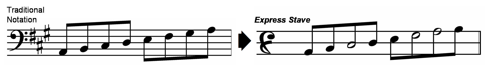
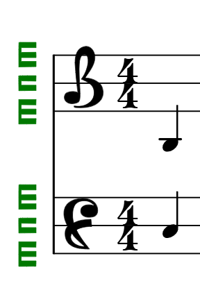
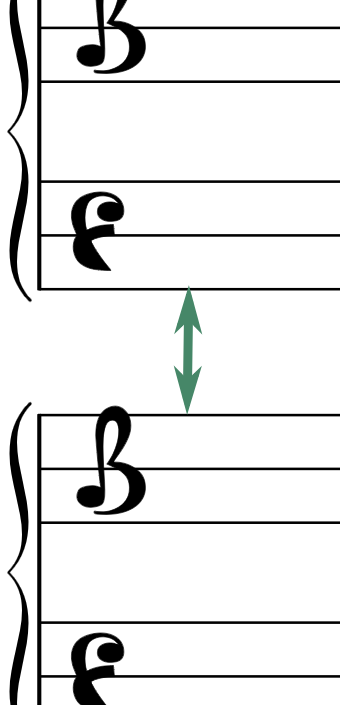
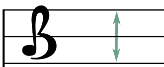
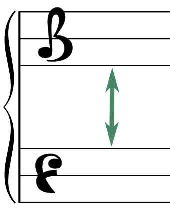
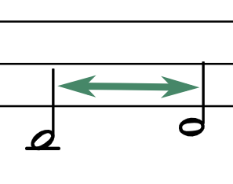
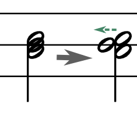

# Express Stave support for LilyPond



## About This Project

This library allows **LilyPond** users to convert `.ly` files to the **Express Stave** alternative notation format. It supports both the Express Stave **Pianoforte** and **original** formats, applying **Pianoforte** by default.

Converting a notation to the Express Stave format is easy: Just add a single line at the start of your `.ly` notation file:

```
\include "/path/to/express-stave.ly"
```

### About Express Stave

[Express Stave](https://musicnotation.org/system/express-stave-by-john-keller/) by **John Keller** is an alternative music notation format. It is highly intuitive and simple to understand. more information can be found in the [Music Notation Project Wiki](https://musicnotation.org/wiki/notation-systems/express-stave-by-john-keller/)

### About LilyPond
[LilyPond](https://lilypond.org/) is a free, open-source music notation and engraving program. 
It allows simple conversion from MusicXML (.xml, .musicxml, .mxl) files using the `musicxml2ly` utility, making it a versatile tool for all kinds of sheet music.

> **NOTE:** this document assumes you have basic understanding of LilyPond and its syntax. To leasrn more, please refer to the [LilyPond documentation](https://lilypond.org).

## System Setup

This library can be used on Windows, MacOS and Linux systems. To use, download the [`lib/express-stave.ly`](./lib/express-stave.ly) file to your computer: Click [here](./lib/express-stave.ly) to go to the file page, and download it by clicking the  (download) button at the right.

> **NOTE:** `lib/express-stave.ly` is the only file required to use this library.

### LilyPond Installation

Download and install lilypond from https://lilypond.org/download.html. This library was developed and tested on LilyPond version 2.24.4.

You can find more detailed installation instructions for both LilyPond and Frescobaldi [here](https://lilypond.org/doc/v2.24/Documentation/learning/installing).

### Graphic .ly File Editor Installation (optional)

To visually edit .ly files in a graphic environment, it is recommended to install one of the following:

#### Visual Studio Code

[Visual Studio Code](https://code.visualstudio.com/) is a free all-purpose code editor. It offers enhanced support for .ly files editing and visualization.

First, install it from https://code.visualstudio.com/download

Next, install the LilyPond extension. Go to the Extensions menu (keyboard shortcut Cmd+Shift+X on Mac or Ctrl+Shift+X on Windows/Linux) and install the `VSLilyPond` extension.

### Frescobaldi

[Frescobaldi](https://frescobaldi.org/) is free dedicated LilyPond sheet music text editor.

To install, follow the instructions at https://frescobaldi.org/download.html

## Converting an `.ly` file to Express Stave engraving

This library aims at minimal effort conversion of existing `.ly` files. Simply include the express-stave file at the beginning of your sheet music file:

  ```
  \include "/path/to/express-stave.ly"
  ```

> **NOTE:** Change the path to the correct relative/absolute position of the file, e.g. `../lib/express-stave.ly`

### Expres Stave Original Support

By default, the script converts to the **Express Stave Pianoforte** notation. In order to use the **Express Stave Original** notation, add `#(define express-pianoforte 0)` **before** including the library:

  ```
  #(define express-pianoforte 0)
  \include "/path/to/express-stave.ly"
  ```

### Displaying The Pianoroll

It is possible to display a pianoroll mark to the left of the staff lines. This can assist in identifying which piano keys each note refers to. To display, add `#(define express-showpianoroll 1)` **before** including the library:

<div style="display: flex; align-items: center;">
  <div style="width:100%">
    <pre><code>  #(define express-showpianoroll 1)
  \include "/path/to/express-stave.ly"

</code></pre>
  </div>
  
</div>

## Examples

The [`examples/`](./examples/) directory contains various examples. See the [`examples/example_es.ly`](./examples/example_es.ly) file for a simple usage example of this library. 

Start by downloading it to your local machine. Locate the line that includes the library at the beginning of the file:

```
\include "../lib/express-stave.ly"
```

> Change the path to match where the library is located on you machine.

Next, generate a pdf file using the `lilypond`. The result should be similar to the example pdf output available in [`examples/example_es.pdf`](./examples/example_es.pdf).

## Tips & Tricks

### Converting `musicXML` files into LilyPond `.ly` files

LilyPond allows simple coversion of musicXML files (`.musicxml`, .`xml`, .`mxl`) to `.ly` format, using LilyPond's `musicxml2ly.py` script. For example:

```
musicxml2ly.py prelude-8.mxl
```

### Upgrading old `.ly` file versions

Older `.ly` files may need to be upgraded to newer LilyPond file versions by using LilyPond's `convert-ly.py` command. For example:

``convert-ly.py -e nocturne-11.ly``

### Fixing Layout Problems

In some cases, it is required to optimize the notation layout in order to fit the new express stave notation format. This section addresses common layout issues.

#### Debugging

To display debug information regarding spacing, add the following to the ``\print`` section:
```
annotate-spacing = ##t
```

Also, it is recommended to enable PDF point and click: comment out any `\pointAndClickOff` commands. This will let you jump from your current cursor position to the relevant PDF area and back.


> In **Visual Studio Code**, you can jump from your current cursor position in the `.ly` file to the note position on the `.pdf` file, use the following command:
>
> `Ctrl + Shift + P => LilyPond PDF Preview: Go to PDF location from Cursor`
> 
> You may add a keyboard shortcut to this command (e.g. F2) and setting the `when` option to `editorTextFocus && editorLangId == 'lilypond'`

#### Clefs and Octaves

You may need to modify existing `\clef` and `\ottava` commands to better fit the Express Stave note positions

Express Stave overrides the `\clef` command and supports the following clefs:

  `\clef treble` translates to the Express Stave **B (treble)** clef

  `\clef alto` translates to the Express Stave **D (middle)** clef

  `\clef bass` translates to the Express Stave **F (bass)** clef


#### Spacing

To control the space between note line systems, add the following to the ``\paper`` section:

<div style="display: flex; align-items: center;">
  <div style="width:100%">
    <pre><code>  system-system-spacing =
    #'((basic-distance . 14)
       (minimum-distance . 8)
       (padding . 1)
       (stretchability . 0))

</code></pre>
  </div>
  
</div>


To scale the notation size, add the following to the ``\paper`` section:
```
    #(layout-set-staff-size 18)
```

To control the vertical staff spacing (that's the space between the three staff lines), add:

<div style="display: flex; align-items: center;">
  <div style="width:100%">
    <pre><code>    #(define express-staff-space 1.2) % add this BEFORE including MNP-scripts.ly
    \include "../lib/MNP-scripts.ly"
</code></pre>
  </div>
  
</div>


To control the space between the right-hand and left-hand staff lines, add the following to the ``\layout`` section:

<div style="display: flex; align-items: center;">
  <div style="width:100%">
    <pre><code>\override StaffGrouper.staff-staff-spacing = 
    #'((basic-distance . 12)
    (minimum-distance . 8)
    (padding . 1)
    (stretchability . 0))
</code></pre>
  </div>
  
</div>

To control horizontal notation spacing, add the following to the ``\layout`` section:

<div style="display: flex; align-items: center;">
  <div style="width:100%">
    <pre><code>    % controls the horizontal (width) spacing between notes
    \override SpacingSpanner.spacing-increment = #3.0 
</code></pre>
  </div>
  
</div>

This library automatically adjusts notehead positions to avoid collisions. If you need more control, use the `snhs` (Shift Noteheads) command, that defines the shift of all notes in a chord, e.g.

<div style="display: flex; align-items: center;">
  <div style="width:100%">
    <pre><code>    % without shifting, noteheads are crammed
    &lt;c d e&gt;4
    % shift the 2nd note (d) one step to the left:
    \snhs #'(0 -1 0)
    &lt;c d e&gt;4
</code></pre>
  </div>
  
</div>

Alternatively, you can use the `\shiftl` and `\shiftr` commands to offset a single notehead away from the others, e.g.

```
% achieves similar results to \snhs above:
<c \shiftl d e>4
```

You can also use `\hshift` to move an entire note group, along with the stem. This can be useful when several notes from different voices collide.

```
\hshift 0.6 % shifts the next note to the right
c 
```

Add ``\break`` commands between bars to force line breaks. Add ``\pageBreak`` to force page breaks.

To control the space between textual comments and notation, add:

```
\override Score.MetronomeMark.padding = #4
```

### Errors and Warnings

Fixing `no viable initial configuration found: may not find good beam slope` warnings:

These warnings happen when the system has problems rendering a connector beams. You may notice strange beam angles in the affected area. You may safely ignore these if the display is correct. To fix, add the following **right before** the problematic section:

```
    \beampos -12.5 -10 % change these values until you are pleased with the result
```


Fixing `this Voice needs a \voiceXx or \shiftXx setting` warnings:

These warnings happen when there are different voices attempting to show different notes in the same staff with the same stem direction. You may notice notes that are supposed to be in the same position, rendered next to each other instead. To fix, experiment with using one of the following before the problematic note:

Change the stem direction using the `\stemUp` and `\stemDown`. Don't forget to call `\stemNeutral` after to revert to the original stem direction.

Change the note's voice using `\voiceOne`, `\voiceTwo`, etc. Remember to revert back to the original voice at the end of the section. For example:

```
% this section is part of \voiceOne. we are fixing the voice warning on the g note:
f f \voiceThree g \voiceOne c |
```
